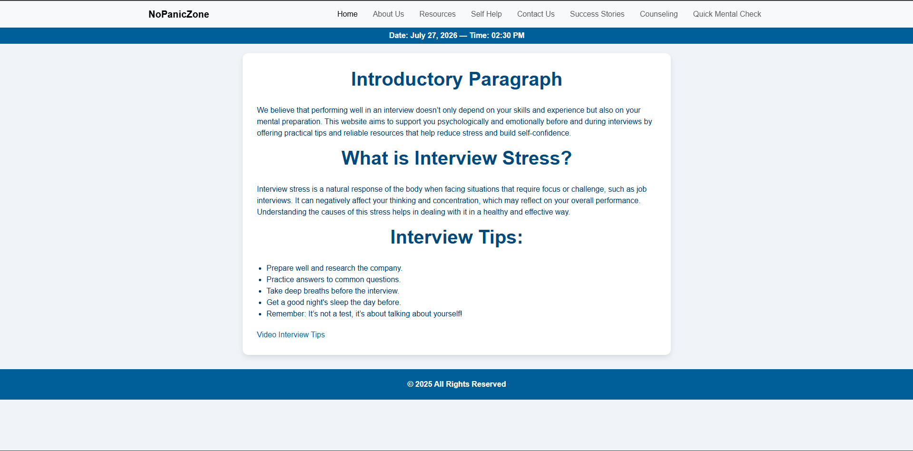

# NoPanicZone 🧠

NoPanicZone is a web project designed to provide helpful resources, guidance, and practical tips related to mental well-being, stress management, and personal support.

The website includes multiple pages that provide users with self-help resources, counseling information, success stories, and useful mental health content.

## Features

- Home page
- Self-help resources
- Mental health resources
- Counseling information
- Success stories
- Contact page
- Interactive form
- Multimedia content

## Technologies Used

- HTML
- CSS
- Bootstrap
- JavaScript

## Project Purpose

This project was developed as a university project to practice building a multi-page website and organizing different types of web content using HTML and CSS.

## Screenshot

## Author

Abdulrahman Salameh