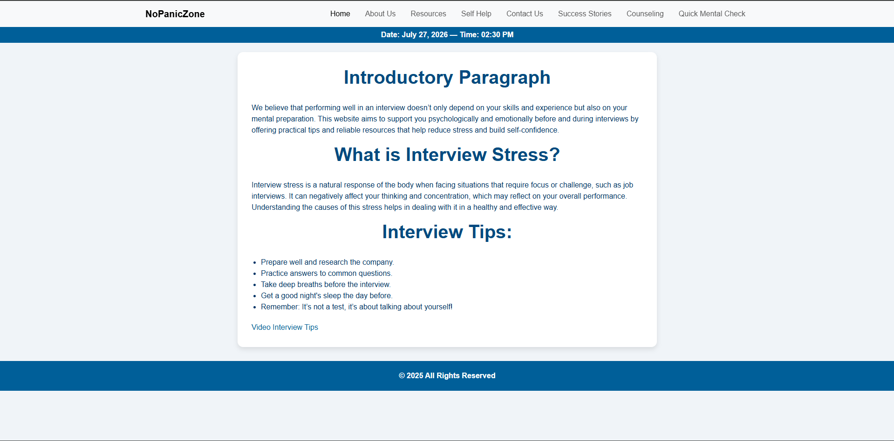

# NoPanicZone 🧠

An introductory university web development project implemented by Abdulrahman Salameh using HTML, CSS, Bootstrap, and JavaScript.

Interview stress was used as the theme for practicing multi-page layouts, navigation, multimedia, and client-side form handling.

## Project Purpose

The project fulfilled the university assignment requirements at the time of submission. Its scope was educational, with a focus on applying web development fundamentals.

## Implemented Features

- Eight linked HTML pages.
- Navigation built with Bootstrap.
- Informational pages and links to external resources.
- Images and embedded videos.
- Fictional stories displayed in a card layout.
- A JavaScript form that validates required inputs.
- A text report generated from form answers using predefined conditions.
- A date and time display that updates automatically.
- Developer contact links.

## Technologies

- HTML
- CSS
- Bootstrap
- JavaScript

## Scope and Limitations

This is a static educational website, not a professional counseling service or a clinically validated assessment tool.

- Stories, names, and outcomes in the stories section are fictional examples.
- The form demonstrates conditional JavaScript logic; it does not provide a medical diagnosis.
- Form answers and generated reports are not saved to a database or sent to a server.
- The project does not include a backend or user accounts.
- Styling, navigation, and date/time code are repeated across pages and could be consolidated.
- Design, accessibility, content review, and testing are areas for further improvement.

## Run Locally

1. Clone or download the repository.
2. Open the project folder in VS Code.
3. Serve the folder using a local server, such as Live Server.
4. Open `index.html` through the server.

An internet connection is needed to load Bootstrap from its CDN and access external resources.

## Pages

- `index.html` — introduction and interview tips
- `aboutus.html` — project background and scope
- `MentalHealthResources.html` — informational content and external resources
- `SelfHelp.html` — tips and video content
- `SuccessStories.html` — fictional example stories
- `counseling.html` — links to external support platforms
- `form.html` — input validation and a rule-based report
- `contactUs.html` — developer contact links

## Screenshot

## Author

**Abdulrahman Salameh**

[GitHub](https://github.com/abdulrahmanSalameh) · [LinkedIn](https://www.linkedin.com/in/abdulrahman-ahmad-salameh/)
